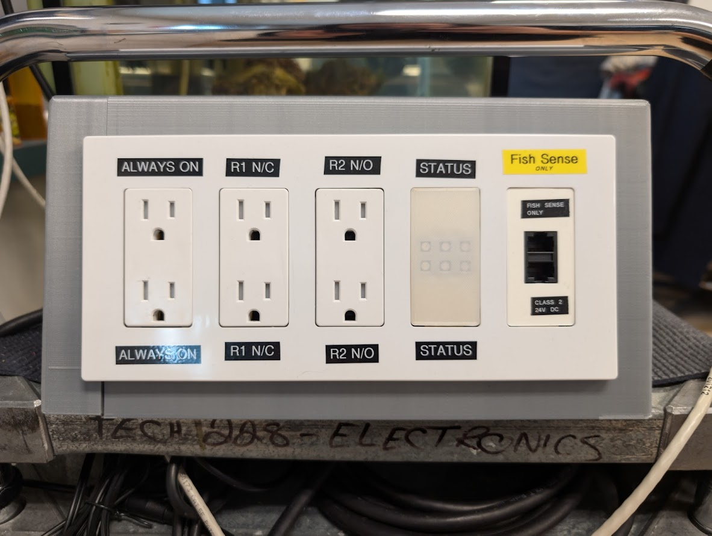
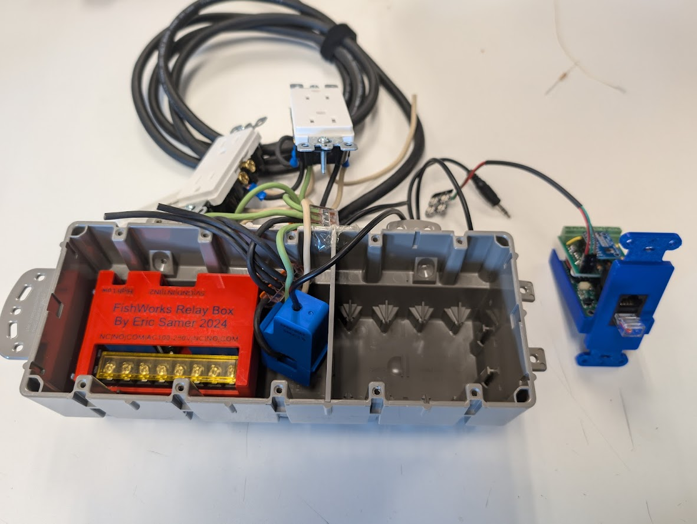

# Device AC Outlet Control

The AC outlet control device allows for the control standard household AC outlets. The deivce provides two channels of switchabled outlets that can be toggled mannually or automatically in response to alerts fromo other devices.

## Hardware

[text](Firmware/Device-AC_OutletControl-Firmware/src/main.cpp)

## Firmware
### Message IDs and Format
| Parameter | Message ID | Data Format |
| --------- | ---------- | ----------- |
| Relay 1 Toggle | 0x0A00 | bool on/off |
| Relay 2 Toggle | 0x0A01 | bool on/off |
| Current (A) | 0x0A02 | 32bit float |
| Relay 1 Alert Node | 0x0A03 | int |
| Relay 2 Alert Node | 0x0A04 | int |
| Relay 1 Alert Invert | 0x0A07 | bool, 1 = inverted, 0 =  non inverted |
| Relay 2 Alert Invert | 0x0A08 | bool, 1 = inverted, 0 =  non inverted |
